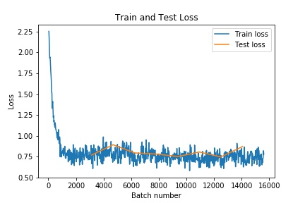

# Quick-Draw-CNN
A convolutional neural net that classifies images from Google's Quick, Draw! dataset.

## Project Description

Our project could be used as a part of a drawable-search feature for the emoji keyboard. When designing this model, we had to consider the different representations of emojis across platforms and also the different interpretations of representing a word visually. 

 
           

 
Open Book (Left); Closed Book (Right)

One consideration was that people can interpret a book to be drawn as either an open book or a closed book. The CNN should be able to understand both interpretations.

Apple Emoji (Left); Google Emoji (Right)

Another consideration was that operating systems can vary in the way they represent emojis (Apple vs Google emoji Keyboards). These differences are converging; however, some discrepencies still remain.

Since our product would be more of a novelty feature of a phone's keyboard, it would be fine with a non-perfect level of accuracy. The stakeholders would be people who are new and unfamiliar with the emoji keyboard, so adults that are new to technology, but also good at drawing. One risk of our algorithm not working properly would be frustration of adults with needing to scroll through the entire emoji keyboard to find the emoji they are looking for.

## The Data

We used drawings from [Google's Quick, Draw!](https://quickdraw.withgoogle.com/data) dataset. 

Heatmap of an Airplane Drawing

  

The drawings were represented as a 28x28 heatmap

We deliberatly chose datasets that looked different from each other in order to create a more accurate model to validate that our algorithm could work to classify images.

The datasets we chose were: airplane, basketball, bee, bicycle, butterfly, cookie, helicopter, lightbulb, pants, and strawberry.
The datasets can be found [here](https://drive.google.com/drive/folders/1FwAnEra0XktCBU55ziDWUhDA-L-uWXzF?usp=sharing).

## The Results

The model was able to correctly guess images within a resonable margin of error!

 

 
A heatmap of the test drawing used in the CNN

 

The CNN was able to correctly classify the airplane as the Confidence Plot shows the tallest bar for the airplane class.

 

The CNN was well trained as both the training and testing data had low loss. 

 

We discoved that 50000 images in the training set, 5000 in each class, gave us around 79% accuracy of correctly classifying the drawing in the testing data set. The training accuracy was around 82% accurate.
 

A Confusion Matrix shows output of the CNN as a count of the most confident prediction for each drawing in the test dataset. 

We can tell that our algorithm was well designed as the highest results are along the diagonals where the actual and predicted categories correspond. According to this chart, the CNN has the highest accuracy when trying to classify a bicycle drawing, 
but it has the lowest accuracy when classifing a drawing of a bee. 
